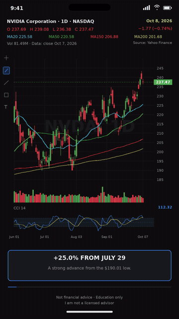

# NVDA — animated daily chart analysis

**Updated version:** chart tools draw progressively, the measurement stretches across the chart, a cursor follows the explanation, and the viewport zooms smoothly into the last candles. Labels and news panels enter in time with the narration.

[Download the full animated MP4](NVDA_analysis_animated_2026-10-08.mp4?raw=1) · 1080×1920 · 30 fps · 92 seconds

If GitHub opens the file page, select **Download raw** or the download icon.

## Motion preview

This short, silent preview shows the range tool and the smooth zoom. The full MP4 includes English narration, quiet music and the 1.2-second cover intro.

Data: October 7, 2026 close. Analysis date: October 8, 2026. Market source: Yahoo Finance. The underlying historical prices and the previously checked narration are unchanged; the animation does not simulate live prices or invent intraday ticks.

Education only. Not financial advice. Not a recommendation to buy or sell.
